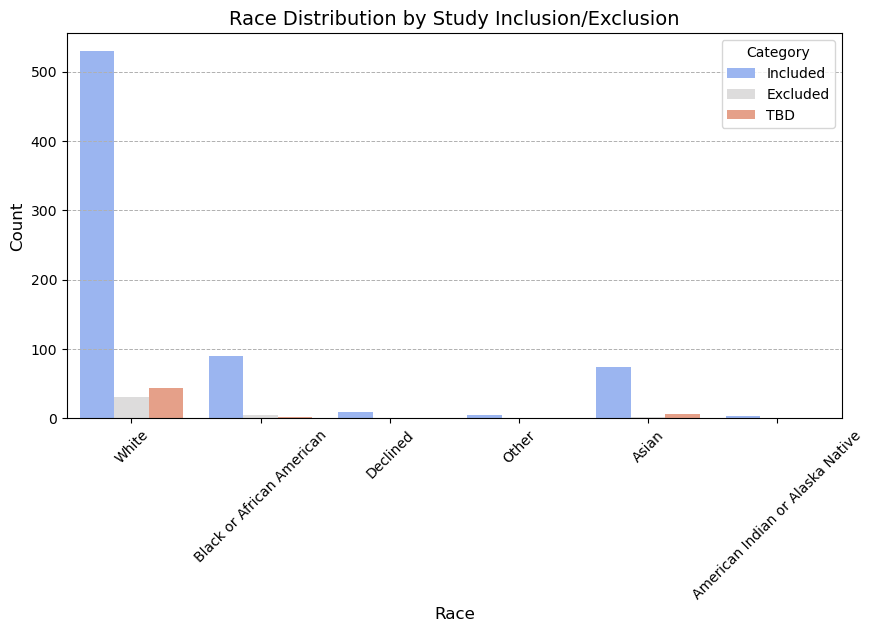
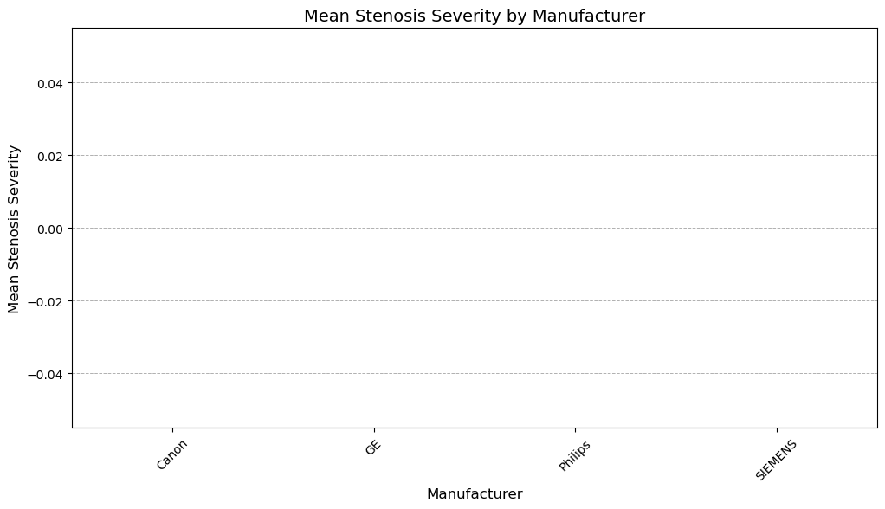

## 6. Create a new column that contains the first five numeric characters from the mod_patient_id field. This is representative of the patient's site of treatment
#### Purpose of the code
The purpose of the code below is to process a dataset by extracting the first five numeric characters from the mod_patient_id column to create a new column called site_of_treatment, which represents the patient’s site of treatment. I first ensured that the mod_patient_id column exists in the dataset. Then, I applied a function to extract the numeric characters and added them as a new column. Finally, I saved the updated dataset to an Excel file and displayed the first few rows of the modified dataset to verify the changes. This approach allows me to identify treatment sites in a structured and easily accessible format.

**Code**  
import pandas as pd

#### Load the dataset
file_path = r"C:\Users\username\Documents\MedTechProject\data\clinical_primary_dataset.xlsx"  
data = pd.read_excel(file_path)  

#### Ensure the 'mod_patient_id' column exists  
if 'mod_patient_id' not in data.columns:  
    raise ValueError("The dataset must contain the 'mod_patient_id' column.")  

#### Create a new column with the first five numeric characters from 'mod_patient_id'  
def extract_site_id(mod_patient_id):  
    # Extract the first five numeric characters  
    numeric_characters = ''.join(filter(str.isdigit, str(mod_patient_id)))  
    return numeric_characters[:5] if len(numeric_characters) >= 5 else None  

data['site_of_treatment'] = data['mod_patient_id'].apply(extract_site_id)  

#### Save the updated dataset  
output_file = r"C:\Users\username\Documents\MedTechProject\outputs\updated_dataset.xlsx"  
data.to_excel(output_file, index=False)  

#### Display the first few rows of the updated dataset  
print(data[['mod_patient_id', 'site_of_treatment']].head())  
print(f"Updated dataset with 'site_of_treatment' column saved to: {output_file}")  

#### Output

## 7.Demographic Analysis and Visualization of Patient Data

#### Purpose of the code

The purpose of the code below is to analyze and visualize the demographics of the dataset, focusing on the distribution of age, gender, and race among patients categorized as "Included," "Excluded," or "To Be Determined" (TBD). I ensured that all necessary columns for the analysis were present, and the visualizations generated highlight patterns, trends, or disparities in these demographic groups. Additionally, I saved a summary table with descriptive statistics for age into an Excel file to allow for further analysis or reporting.

I carefully designed the graph selection to provide clear and actionable insights. For gender distribution, I used a bar chart to offer a straightforward comparison of male and female patients across inclusion categories, making it easy to spot potential disparities in representation. Similarly, I used another bar chart to display the racial composition across inclusion categories, highlighting any over- or under-representation of specific racial groups and supporting diversity analysis. For age distribution, I replaced the histogram with a box plot to better summarize the data. The box plot makes it easier to identify the median, interquartile range, and outliers in age for each inclusion category, enabling a more precise comparison between groups.

These visualizations are intuitive and actionable, providing clinicians or study coordinators with valuable insights to refine inclusion criteria, address representation gaps, and ensure a diverse and equitable population in clinical studies.

**Code**

import pandas as pd  
import matplotlib.pyplot as plt  
import seaborn as sns  

#### Load the dataset  
file_path = r"C:\Users\username\Documents\MedTechProject\outputs\primary_data_categorized.xlsx"  
data = pd.read_excel(file_path)  

#### Ensure necessary columns exist  
required_columns = ['age_generated', 'sex', 'race_mapped', 'category']  
missing_columns = [col for col in required_columns if col not in data.columns]  
if missing_columns:
    raise ValueError(f"The following columns are missing: {', '.join(missing_columns)}")  

#### Distribution of Gender using bar graph  
plt.figure(figsize=(8, 5))  
sns.countplot(data=data, x='sex', hue='category', palette='Set2')  
plt.title('Gender Distribution by Study Inclusion/Exclusion', fontsize=14)  
plt.xlabel('Gender', fontsize=12)  
plt.ylabel('Count', fontsize=12)  
plt.legend(title='Category', labels=['Included', 'Excluded', 'TBD'])  
plt.grid(axis='y', linestyle='--', linewidth=0.7)  
plt.show()  

#### Distribution of Race using bar graph  
plt.figure(figsize=(10, 5))  
sns.countplot(data=data, x='race_mapped', hue='category', palette='coolwarm')  
plt.title('Race Distribution by Study Inclusion/Exclusion', fontsize=14)  
plt.xlabel('Race', fontsize=12)  
plt.ylabel('Count', fontsize=12)  
plt.legend(title='Category', labels=['Included', 'Excluded', 'TBD'])  
plt.xticks(rotation=45)  
plt.grid(axis='y', linestyle='--', linewidth=0.7)  
plt.show()  

#### Distribution of Age using Box Plot  
plt.figure(figsize=(10, 6))  
sns.boxplot(data=data, x='category', y='age_generated', palette='muted')  
plt.title('Age Distribution by Study Inclusion/Exclusion', fontsize=14)  
plt.xlabel  

#### Output

## 8. Calcium Score Categorization and Risk Assessment
#### Purpose of the code
The purpose of my code is to explore and define calcium score categories by grouping scores into ranges and analyzing their association with severity levels. It identifies logical thresholds for risk levels such as low, moderate, and high, based on the distribution of calcium scores and their clinical relevance. The code also generates visualizations to support the analysis and provide actionable recommendations for meaningful calcium score ranges.
A histogram is used to visualize the overall distribution of calcium scores, highlighting clusters and outliers, while a box plot compares ranges within predefined or suggested risk categories. These graphs simplify the analysis and help clinicians or researchers refine calcium score thresholds for risk assessments and clinical decisions.

**Code**
import pandas as pd  
import matplotlib.pyplot as plt  
import seaborn as sns  

#### Load the dataset
file_path = r"C:\Users\username\Documents\MedTechProject\data\primary_data_categorized.xlsx"  
data = pd.read_excel(file_path)  

#### Ensure necessary columns exist
required_columns = ['calcium_score_modified', 'stenosis_severity']  
missing_columns = [col for col in required_columns if col not in data.columns]  
if missing_columns:  
    raise ValueError(f"The following columns are missing: {', '.join(missing_columns)}")  

#### Explore calcium score distribution  
plt.figure(figsize=(10, 6))  
sns.histplot(data['calcium_score_modified'], kde=True, bins=30, color='skyblue')  
plt.title('Distribution of Calcium Scores', fontsize=14)  
plt.xlabel('Calcium_score', fontsize=12)  
plt.ylabel('Frequency', fontsize=12)  
plt.grid(axis='y', linestyle='--', linewidth=0.7)  
plt.show()  

#### Boxplot to analyze calcium scores by severity levels  
plt.figure(figsize=(10, 6))  
sns.boxplot(data=data, x='stenosis_severity', y='calcium_score_modified', palette='coolwarm')  
plt.title('Calcium Score by Stenosis Severity', fontsize=14)  
plt.xlabel('Stenosis Severity', fontsize=12)  
plt.ylabel('calcium_score_modified', fontsize=12)  
plt.grid(axis='y', linestyle='--', linewidth=0.7)  
plt.show()  

#### Suggest calcium score ranges by analyzing quartiles  
data['calcium_score_range'] = pd.qcut(data['calcium_score_modified'], q=4, labels=['Low', 'Moderate', 'High', 'Very High'])  

#### Summary of calcium scores by ranges  
range_summary = data.groupby('calcium_score_range')['calcium_score_modified'].agg(['min', 'max', 'mean']).reset_index()  
print("Suggested Calcium Score Ranges:")  
print(range_summary)  

#### Save the summary to an Excel file  
output_file = r"C:\Users\username\Documents\MedTechProject\outputs\calcium_score_ranges.xlsx"  
range_summary.to_excel(output_file, index=False)  
print(f"Calcium score ranges and summary saved to: {output_file}")  

#### Output

## 9. Imaging Machine Manufacturer Analysis
#### Purpose of the code
The purpose of my code is to analyze the distribution of imaging machine manufacturers in the dataset and explore whether certain manufacturers are associated with variations in reported risk factors or stenosis severity. By identifying patterns or discrepancies across manufacturers, my code provides insights into their potential impact on clinical outcomes. This analysis aims to determine whether the choice of manufacturer contributes to variability in imaging results, enabling informed decision-making and ensuring quality control in clinical studies.
I chose a bar chart to display the distribution of imaging machine manufacturers because it provides a clear and intuitive view of their representation in the dataset. I also intended to include a box plot to analyze manufacturer-specific stenosis severity, highlighting variations across manufacturers, severity levels, and identifying outliers or trends. However, due to insufficient or missing data in the stenosis_severity column, I was unable to generate meaningful visualizations for the box plot.

**Code**  
import pandas as pd  
import matplotlib.pyplot as plt  
import seaborn as sns  

#### Load the dataset
file_path = r"C:\Users\username\Documents\MedTechProject\data\primary_data_categorized.xlsx"  
data = pd.read_excel(file_path)  

#### Ensure necessary columns exist
required_columns = ['manufacturer_mapped', 'stenosis_severity']  
missing_columns = [col for col in required_columns if col not in data.columns]  
if missing_columns:  
    raise ValueError(f"The following columns are missing: {', '.join(missing_columns)}")  

#### Visualization 1: Distribution of Imaging Machine Manufacturers  
plt.figure(figsize=(10, 6))  
sns.countplot(data=data, x='manufacturer_mapped', palette='Set3')  
plt.title('Distribution of Imaging Machine Manufacturers', fontsize=14)  
plt.xlabel('Manufacturer', fontsize=12)  
plt.ylabel('Count', fontsize=12)  
plt.xticks(rotation=45)  
plt.grid(axis='y', linestyle='--', linewidth=0.7)  
plt.show()  

#### Visualization 2: Stenosis Severity by Manufacturer (Bar Chart)  
#### Ensure 'stenosis_severity' is numeric for calculations  
if not pd.api.types.is_numeric_dtype(data['stenosis_severity']):  
    data['stenosis_severity'] = pd.to_numeric(data['stenosis_severity'], errors='coerce')  

#### Calculate mean stenosis severity by manufacturer  
stenosis_mean = data.groupby('manufacturer_mapped')['stenosis_severity'].mean().reset_index()  

#### Bar Chart for Stenosis Severity  
plt.figure(figsize=(12, 6))  
sns.barplot(data=stenosis_mean, x='manufacturer_mapped', y='stenosis_severity', palette='coolwarm')  
plt.title('Mean Stenosis Severity by Manufacturer', fontsize=14)  
plt.xlabel('Manufacturer', fontsize=12)  
plt.ylabel('Mean Stenosis Severity', fontsize=12)  
plt.xticks(rotation=45)  
plt.grid(axis='y', linestyle='--', linewidth=0.7)  
plt.show()  

#### Summary of manufacturer-specific stenosis severity  
manufacturer_summary = data.groupby('manufacturer_mapped')['stenosis_severity'].describe()  

#### Save the summary to an Excel file  
output_file = r"C:\Users\username\Documents\MedTechProject\outputs\manufacturer_insights.xlsx"  
manufacturer_summary.to_excel(output_file)  
print(f"Manufacturer-specific insights saved to: {output_file}")  

#### Output

