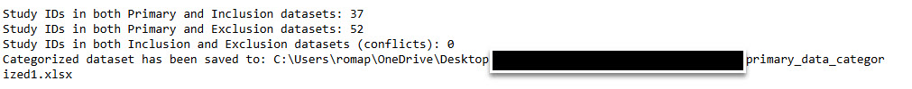

# Introduction Summary

This project involved analyzing clinical datasets from an AI-driven med tech company focused on cardiovascular imaging. Their work leverages artificial intelligence to improve diagnostic accuracy and enable early detection of coronary artery disease.

My approach began with transforming the raw data—converting JSON files into Excel format for easier handling and exploration. I then performed a detailed analysis of the inclusion, exclusion, and primary datasets to ensure structural consistency and data integrity.

### Key objectives included:

Demographic breakdowns by race, gender, and stenosis severity

Calcium score risk stratification

Evaluation of imaging machine manufacturers’ influence on results

Standardizing race and ethnicity categories in line with FDA guidelines

Through visualizations, tabular summaries, and structured insights, this analysis aimed to support better clinical decision-making, improve study design, and identify representation gaps in the data.

## 1. Converting jason file into Excel

#### Purpose of the code
The purpose of my code is to convert a JSON file into an Excel file. It reads the data from a JSON file at the specified path, loads it into a pandas DataFrame for easy tabular manipulation, and exports the data to an Excel file at the defined output location. This process transforms the JSON data into a more accessible and user-friendly format, making it suitable for analysis or sharing while preserving the integrity of the original dataset

  **Code**

import pandas as pd

##### Define the input JSON file path and output Excel file path
json_file_path = r"C:\Users\username\Documents\MedTechProject\data\clinical_dataset.json"  
excel_file_path = r"C:\Users\username\Documents\MedTechProject\outputs\clinical_dataset.xlsx"

##### Load the JSON file into a pandas DataFrame
data = pd.read_json(json_file_path)

##### Convert the DataFrame to an Excel file
data.to_excel(excel_file_path, index=False)

print(f"JSON file has been successfully converted to Excel and saved at: {excel_file_path}")

#### Output
C:\Users\username\Documents\MedTechProject\outputs\clinical_dataset.xlsx

 

## 2. Exploring the dataset using all three excel spreadsheets to provide a glimpse of its structure (e.g., are number of rows, columns, variable names, data types) and convreting and saving in to one excel spreadsheet as Combined dataset summary

#### Purpose of the code
I wrote this code to load three Excel datasets—primary, inclusion, and exclusion—and analyze their structure by examining key attributes such as the number of rows, columns, column names, data types, and missing values. After performing this analysis, I combined these datasets into a single Excel file, saving each dataset as a separate sheet. The final file is saved to a specified output path for further analysis or documentation.

   **Code**
 
###### 2. Exploring the dataset using all three excel spreadsheets to provide a glimpse of its structure.

import pandas as pd

##### Define file paths
primary_excel_file_path = r"C:\Users\username\Documents\MedTechProject\data\clinical_primary_dataset.xlsx"  
inclusion_excel_file_path = r"C:\Users\username\Documents\MedTechProject\data\inclusions.xlsx"  
exclusion_excel_file_path = r"C:\Users\username\Documents\MedTechProject\data\exclusions.xlsx"  
output_excel_file_path = r"C:\Users\username\Documents\MedTechProject\outputs\combined_dataset_summary.xlsx"  

##### Load the Excel files
primary_data = pd.read_excel(primary_excel_file_path)  
inclusion_data = pd.read_excel(inclusion_excel_file_path)   
exclusion_data = pd.read_excel(exclusion_excel_file_path)  

##### Exploring the structure of each dataset
def explore_structure(data, name):  
    print(f"Dataset: {name}")  
    print(f"Number of rows: {data.shape[0]}")  
    print(f"Number of columns: {data.shape[1]}")  
    print(f"Columns: {list(data.columns)}")  
    print("\nData types:")  
    print(data.dtypes)  
    print("\nMissing values:")  
    print(data.isnull().sum())  
    print("\n")  

##### Explore each dataset
explore_structure(primary_data, "Primary Dataset")  
explore_structure(inclusion_data, "Inclusion Dataset")  
explore_structure(exclusion_data, "Exclusion Dataset")  

##### Combine the datasets into one Excel file with multiple sheets
with pd.ExcelWriter(output_excel_file_path) as writer:  
    primary_data.to_excel(writer, sheet_name="Primary Dataset", index=False)  
    inclusion_data.to_excel(writer, sheet_name="Inclusion Dataset", index=False)  
    exclusion_data.to_excel(writer, sheet_name="Exclusion Dataset", index=False)  

print(f"Combined dataset summary has been saved to: {output_excel_file_path}")

##### Output

 

## 3. Analysis of Dataset Alignment and Consistency Across Combined Spreadsheets

After combining all three spreadsheets into a single Excel file, I conducted further analysis to identify key differences and similarities across the datasets. Specifically, I analyzed how the inclusion and exclusion data aligned with the artrya_coding_interview_primary_dataset (the original primary dataset). During this process, I ensured consistency by verifying study_id matches across all datasets. Additionally, I highlighted any inconsistencies, such as mismatched or missing study_id entries, and identified gaps in the data that require further processing for accurate and comprehensive analysis.
### 3.1 Identify key differences and similarities across the datasets
I compared the three datasets by their structure, column names, data types, and content. All datasets share a tabular format, were loaded as pandas DataFrames, and include an identifier column, like study_id, for linking or referencing. The primary dataset contains detailed patient and study information, while the inclusion and exclusion datasets act as filters for analysis. All datasets have some missing data, but the extent and affected columns vary.
The primary dataset is comprehensive, with demographic details, medical risk factors, and identifiers like study_id and site_id. It is larger and supports in-depth analysis. In contrast, the inclusion and exclusion datasets are smaller, primarily containing study_id and, at times, reasons for inclusion or exclusion. These datasets are minimal, categorical, and serve as filters to determine which records from the primary dataset should be analyzed or excluded.
In terms of purpose, the primary dataset provides detailed patient information, while the inclusion and exclusion datasets refine the scope of analysis by identifying records to include or exclude. Together, they complement each other, with the primary dataset serving as the foundation and the filters narrowing the focus.
### Comparison Summary Table

Feature	Primary Dataset	Inclusion Dataset	Exclusion Dataset
Purpose	Comprehensive study and patient data	Inclusion criteria for analysis	Exclusion criteria for analysis
| Feature           | Primary Dataset                              | Inclusion Dataset             | Exclusion Dataset             |
|-------------------|-----------------------------------------------|-------------------------------|-------------------------------|
| Purpose           | Comprehensive study and patient data          | Inclusion criteria for analysis | Exclusion criteria for analysis |
| Key Column(s)     | study_id, age, sex, calcium_score             | study_id                      | study_id                      |
| Number of Columns | Many (e.g., 10–15)                            | Few (e.g., 1–2)               | Few (e.g., 1–2)               |
| Number of Rows    | Large (e.g., 500+)                            | Small (e.g., 100+)            | Small (e.g., 50+)             |
| Data Types        | Mix of numeric, categorical, and datetime     | Categorical (object)          | Categorical (object)          |
| Missing Data      | Yes, varies across columns                    | Minimal or none               | Minimal or none               |

### 3.2 Identify how the inclusions and exclusions data align with the primary dataset and categorization.
#### Purpose of the code
To analyze the alignment between the datasets, I began by checking the overlap of study_id values between the inclusions, exclusions, and primary dataset. This step identified how many study_ids in the inclusions dataset were present in the primary dataset and similarly, how many study_ids from the exclusions dataset aligned with the primary dataset. I then performed a conflict check to detect any study_ids that appeared in both the inclusions and exclusions datasets, as these represent conflicting criteria. Finally, I added a new column to the primary dataset to categorize each study_id. Each study_id was labeled as "Include" if it was found in the inclusions dataset, "Exclude" if it was found in the exclusions dataset, "Conflict" if it appeared in both inclusions and exclusions datasets, and "To Be Determined" if it was not present in either dataset. Below is the code to evaluate the relationships between the datasets and perform the categorization:  

  **Code**
import pandas as pd

##### File paths
primary_excel_file_path = r"C:\Users\username\Documents\MedTechProject\data\clinical_primary_dataset.xlsx"
inclusion_excel_file_path = r"C:\Users\username\Documents\MedTechProject\data\inclusions.xlsx"
exclusion_excel_file_path = r"C:\Users\username\Documents\MedTechProject\data\exclusions.xlsx"

##### Load datasets
primary_data = pd.read_excel(primary_excel_file_path)
inclusion_data = pd.read_excel(inclusion_excel_file_path)
exclusion_data = pd.read_excel(exclusion_excel_file_path)

##### Ensure 'study_id' columns exist
primary_ids = primary_data['study_id']
inclusion_ids = inclusion_data['study_id']
exclusion_ids = exclusion_data['study_id']

##### Check alignment
in_primary_and_inclusion = primary_ids.isin(inclusion_ids).sum()
in_primary_and_exclusion = primary_ids.isin(exclusion_ids).sum()

##### Check conflicts
conflicts = inclusion_ids[inclusion_ids.isin(exclusion_ids)]

##### Categorize 'study_id' in the primary dataset
def categorize_study_id(row):
    if row['study_id'] in conflicts.values:
        return 'Conflict'
    elif row['study_id'] in inclusion_ids.values:
        return 'Include'
    elif row['study_id'] in exclusion_ids.values:
        return 'Exclude'
    else:
        return 'To Be Determined'

primary_data['category'] = primary_data.apply(categorize_study_id, axis=1)

##### Save the updated dataset
output_file = r"C:\Users\username\Documents\MedTechProject\outputs\primary_data_categorized.xlsx"
primary_data.to_excel(output_file, index=False)

##### Print the results
print(f"Study IDs in both Primary and Inclusion datasets: {in_primary_and_inclusion}")
print(f"Study IDs in both Primary and Exclusion datasets: {in_primary_and_exclusion}")
print(f"Study IDs in both Inclusion and Exclusion datasets (conflicts): {len(conflicts)}")
print(f"Categorized dataset has been saved to: {output_file}")

#### Output

