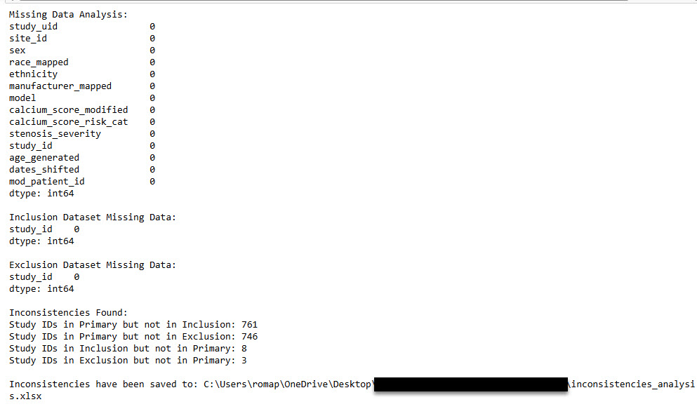
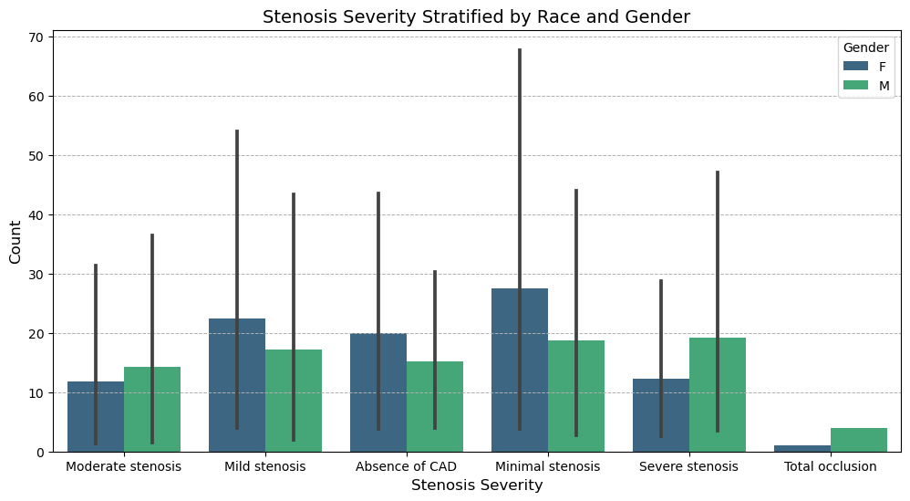
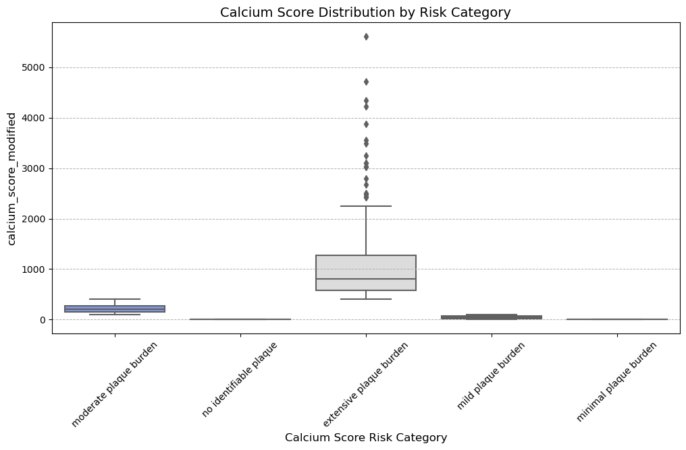
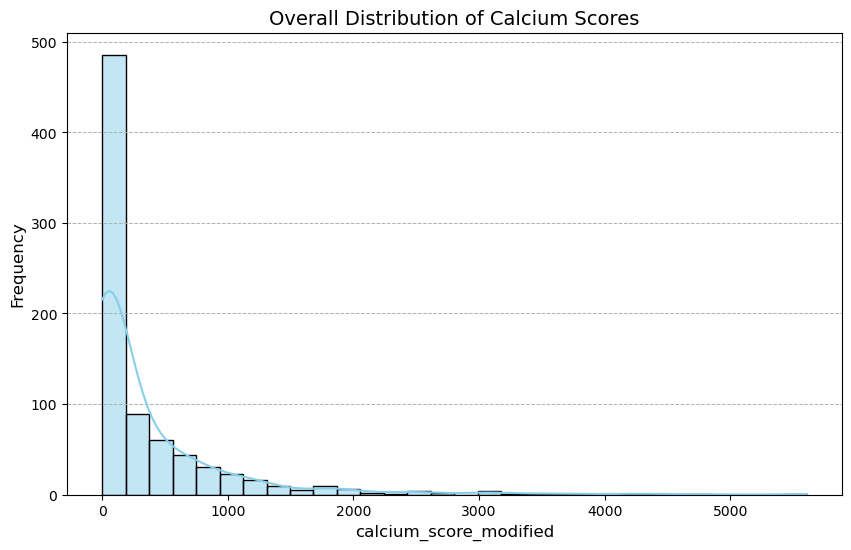

## 1. Converting jason file into Excel

#### Purpose of the code
The purpose of my code is to convert a JSON file into an Excel file. It reads the data from a JSON file at the specified path, loads it into a pandas DataFrame for easy tabular manipulation, and exports the data to an Excel file at the defined output location. This process transforms the JSON data into a more accessible and user-friendly format, making it suitable for analysis or sharing while preserving the integrity of the original dataset

  **Code**

import pandas as pd

##### Define the input JSON file path and output Excel file path
json_file_path = r"C:\Users\username\Documents\MedTechProject\data\clinical_dataset.json"  
excel_file_path = r"C:\Users\username\Documents\MedTechProject\outputs\clinical_dataset.xlsx"

##### Load the JSON file into a pandas DataFrame
data = pd.read_json(json_file_path)

##### Convert the DataFrame to an Excel file
data.to_excel(excel_file_path, index=False)

print(f"JSON file has been successfully converted to Excel and saved at: {excel_file_path}")

#### Output
C:\Users\username\Documents\MedTechProject\outputs\clinical_dataset.xlsx

 

## 2. Exploring the dataset using all three excel spreadsheets to provide a glimpse of its structure (e.g., are number of rows, columns, variable names, data types) and convreting and saving in to one excel spreadsheet as Combined dataset summary

#### Purpose of the code
I wrote this code to load three Excel datasets—primary, inclusion, and exclusion—and analyze their structure by examining key attributes such as the number of rows, columns, column names, data types, and missing values. After performing this analysis, I combined these datasets into a single Excel file, saving each dataset as a separate sheet. The final file is saved to a specified output path for further analysis or documentation.

   **Code**
 
###### 2. Exploring the dataset using all three excel spreadsheets to provide a glimpse of its structure.

import pandas as pd

##### Define file paths
primary_excel_file_path = r"C:\Users\username\Documents\MedTechProject\data\clinical_primary_dataset.xlsx"  
inclusion_excel_file_path = r"C:\Users\username\Documents\MedTechProject\data\inclusions.xlsx"  
exclusion_excel_file_path = r"C:\Users\username\Documents\MedTechProject\data\exclusions.xlsx"  
output_excel_file_path = r"C:\Users\username\Documents\MedTechProject\outputs\combined_dataset_summary.xlsx"  

##### Load the Excel files
primary_data = pd.read_excel(primary_excel_file_path)  
inclusion_data = pd.read_excel(inclusion_excel_file_path)   
exclusion_data = pd.read_excel(exclusion_excel_file_path)  

##### Exploring the structure of each dataset
def explore_structure(data, name):  
    print(f"Dataset: {name}")  
    print(f"Number of rows: {data.shape[0]}")  
    print(f"Number of columns: {data.shape[1]}")  
    print(f"Columns: {list(data.columns)}")  
    print("\nData types:")  
    print(data.dtypes)  
    print("\nMissing values:")  
    print(data.isnull().sum())  
    print("\n")  

##### Explore each dataset
explore_structure(primary_data, "Primary Dataset")  
explore_structure(inclusion_data, "Inclusion Dataset")  
explore_structure(exclusion_data, "Exclusion Dataset")  

##### Combine the datasets into one Excel file with multiple sheets
with pd.ExcelWriter(output_excel_file_path) as writer:  
    primary_data.to_excel(writer, sheet_name="Primary Dataset", index=False)  
    inclusion_data.to_excel(writer, sheet_name="Inclusion Dataset", index=False)  
    exclusion_data.to_excel(writer, sheet_name="Exclusion Dataset", index=False)  

print(f"Combined dataset summary has been saved to: {output_excel_file_path}")

##### Output

 

## 3. Analysis of Dataset Alignment and Consistency Across Combined Spreadsheets

After combining all three spreadsheets into a single Excel file, I conducted further analysis to identify key differences and similarities across the datasets. Specifically, I analyzed how the inclusion and exclusion data aligned with the artrya_coding_interview_primary_dataset (the original primary dataset). During this process, I ensured consistency by verifying study_id matches across all datasets. Additionally, I highlighted any inconsistencies, such as mismatched or missing study_id entries, and identified gaps in the data that require further processing for accurate and comprehensive analysis.
### 3.1 Identify key differences and similarities across the datasets
I compared the three datasets by their structure, column names, data types, and content. All datasets share a tabular format, were loaded as pandas DataFrames, and include an identifier column, like study_id, for linking or referencing. The primary dataset contains detailed patient and study information, while the inclusion and exclusion datasets act as filters for analysis. All datasets have some missing data, but the extent and affected columns vary.
The primary dataset is comprehensive, with demographic details, medical risk factors, and identifiers like study_id and site_id. It is larger and supports in-depth analysis. In contrast, the inclusion and exclusion datasets are smaller, primarily containing study_id and, at times, reasons for inclusion or exclusion. These datasets are minimal, categorical, and serve as filters to determine which records from the primary dataset should be analyzed or excluded.
In terms of purpose, the primary dataset provides detailed patient information, while the inclusion and exclusion datasets refine the scope of analysis by identifying records to include or exclude. Together, they complement each other, with the primary dataset serving as the foundation and the filters narrowing the focus.
### Comparison Summary Table

Feature	Primary Dataset	Inclusion Dataset	Exclusion Dataset
Purpose	Comprehensive study and patient data	Inclusion criteria for analysis	Exclusion criteria for analysis
| Feature           | Primary Dataset                              | Inclusion Dataset             | Exclusion Dataset             |
|-------------------|-----------------------------------------------|-------------------------------|-------------------------------|
| Purpose           | Comprehensive study and patient data          | Inclusion criteria for analysis | Exclusion criteria for analysis |
| Key Column(s)     | study_id, age, sex, calcium_score             | study_id                      | study_id                      |
| Number of Columns | Many (e.g., 10–15)                            | Few (e.g., 1–2)               | Few (e.g., 1–2)               |
| Number of Rows    | Large (e.g., 500+)                            | Small (e.g., 100+)            | Small (e.g., 50+)             |
| Data Types        | Mix of numeric, categorical, and datetime     | Categorical (object)          | Categorical (object)          |
| Missing Data      | Yes, varies across columns                    | Minimal or none               | Minimal or none               |

### 3.2 Identify how the inclusions and exclusions data align with the primary dataset and categorization.
#### Purpose of the code
To analyze the alignment between the datasets, I began by checking the overlap of study_id values between the inclusions, exclusions, and primary dataset. This step identified how many study_ids in the inclusions dataset were present in the primary dataset and similarly, how many study_ids from the exclusions dataset aligned with the primary dataset. I then performed a conflict check to detect any study_ids that appeared in both the inclusions and exclusions datasets, as these represent conflicting criteria. Finally, I added a new column to the primary dataset to categorize each study_id. Each study_id was labeled as "Include" if it was found in the inclusions dataset, "Exclude" if it was found in the exclusions dataset, "Conflict" if it appeared in both inclusions and exclusions datasets, and "To Be Determined" if it was not present in either dataset. Below is the code to evaluate the relationships between the datasets and perform the categorization:  

  **Code**
import pandas as pd

##### File paths
primary_excel_file_path = r"C:\Users\username\Documents\MedTechProject\data\clinical_primary_dataset.xlsx"
inclusion_excel_file_path = r"C:\Users\username\Documents\MedTechProject\data\inclusions.xlsx"
exclusion_excel_file_path = r"C:\Users\username\Documents\MedTechProject\data\exclusions.xlsx"

##### Load datasets
primary_data = pd.read_excel(primary_excel_file_path)
inclusion_data = pd.read_excel(inclusion_excel_file_path)
exclusion_data = pd.read_excel(exclusion_excel_file_path)

##### Ensure 'study_id' columns exist
primary_ids = primary_data['study_id']
inclusion_ids = inclusion_data['study_id']
exclusion_ids = exclusion_data['study_id']

##### Check alignment
in_primary_and_inclusion = primary_ids.isin(inclusion_ids).sum()
in_primary_and_exclusion = primary_ids.isin(exclusion_ids).sum()

##### Check conflicts
conflicts = inclusion_ids[inclusion_ids.isin(exclusion_ids)]

##### Categorize 'study_id' in the primary dataset
def categorize_study_id(row):
    if row['study_id'] in conflicts.values:
        return 'Conflict'
    elif row['study_id'] in inclusion_ids.values:
        return 'Include'
    elif row['study_id'] in exclusion_ids.values:
        return 'Exclude'
    else:
        return 'To Be Determined'

primary_data['category'] = primary_data.apply(categorize_study_id, axis=1)

##### Save the updated dataset
output_file = r"C:\Users\username\Documents\MedTechProject\outputs\primary_data_categorized.xlsx"
primary_data.to_excel(output_file, index=False)

##### Print the results
print(f"Study IDs in both Primary and Inclusion datasets: {in_primary_and_inclusion}")
print(f"Study IDs in both Primary and Exclusion datasets: {in_primary_and_exclusion}")
print(f"Study IDs in both Inclusion and Exclusion datasets (conflicts): {len(conflicts)}")
print(f"Categorized dataset has been saved to: {output_file}")

#### Output

 

## 3.3 Analyze inconsistencies and missing data in the datasets, which can help identify gaps for further processing

#### Purpose of the Code
To conduct the inconsistencies analysis, I used three datasets: the primary dataset, the inclusion dataset, and the exclusion dataset, with a focus on identifying missing data and inconsistencies. The analysis began by examining missing values in each dataset. Next, I compared study_id values across the datasets to identify discrepancies, such as study_ids that appear in one dataset but are absent in another. These discrepancies were categorized into four groups (e.g., Primary_Not_In_Inclusion, Inclusion_Not_In_Primary) and saved into an Excel file, with each category organized in separate sheets (tabs). The analysis concluded with a summary of the missing data and inconsistencies, along with the file path to the saved results

  **Code**
import pandas as pd

#### File paths
primary_excel_file_path = r"C:\Users\username\Documents\MedTechProject\data\clinical_primary_dataset.xlsx"  
inclusion_excel_file_path = r"C:\Users\username\Documents\MedTechProject\data\inclusions.xlsx"  
exclusion_excel_file_path = r"C:\Users\username\Documents\MedTechProject\data\exclusions.xlsx"  

#### Load datasets
primary_data = pd.read_excel(primary_excel_file_path)  
inclusion_data = pd.read_excel(inclusion_excel_file_path)  
exclusion_data = pd.read_excel(exclusion_excel_file_path)  

#### Ensure 'study_id' columns exist  
primary_ids = primary_data['study_id']  
inclusion_ids = inclusion_data['study_id']  
exclusion_ids = exclusion_data['study_id']  

#### Check for missing data in each dataset  
print("Missing Data Analysis:")  
print(primary_data.isnull().sum())  
print("\nInclusion Dataset Missing Data:")  
print(inclusion_data.isnull().sum())  
print("\nExclusion Dataset Missing Data:")  
print(exclusion_data.isnull().sum())  

#### Check for inconsistencies (study_ids present in one dataset but not in others)  
in_primary_not_in_inclusion = primary_ids[~primary_ids.isin(inclusion_ids)]  
in_primary_not_in_exclusion = primary_ids[~primary_ids.isin(exclusion_ids)]  
in_inclusion_not_in_primary = inclusion_ids[~inclusion_ids.isin(primary_ids)]  
in_exclusion_not_in_primary = exclusion_ids[~exclusion_ids.isin(primary_ids)]  

print("\nInconsistencies Found:")  
print(f"Study IDs in Primary but not in Inclusion: {len(in_primary_not_in_inclusion)}")  
print(f"Study IDs in Primary but not in Exclusion: {len(in_primary_not_in_exclusion)}")  
print(f"Study IDs in Inclusion but not in Primary: {len(in_inclusion_not_in_primary)}")  
print(f"Study IDs in Exclusion but not in Primary: {len(in_exclusion_not_in_primary)}")  

#### Save inconsistent IDs for further analysis  
inconsistencies = {  
    "Primary_Not_In_Inclusion": in_primary_not_in_inclusion,  
    "Primary_Not_In_Exclusion": in_primary_not_in_exclusion,  
    "Inclusion_Not_In_Primary": in_inclusion_not_in_primary,  
    "Exclusion_Not_In_Primary": in_exclusion_not_in_primary,  
}  

output_file = r"C:\Users\username\Documents\MedTechProject\outputs\inconsistencies_analysis.xlsx"  
with pd.ExcelWriter(output_file) as writer:  
    for key, value in inconsistencies.items():  
        value.to_frame(name=key).to_excel(writer, sheet_name=key, index=False)  

print(f"\nInconsistencies have been saved to: {output_file}")  

#### Output

 

## 4. Provide the reviewer an idea of unique categories for all categorical variables 

#### Purpose of the code
The purpose of the code below is to analyze the categorical variables in a dataset by identifying and summarizing their unique categories. I first load the dataset from an Excel file and detect all columns containing categorical data types. For each categorical variable, I calculate the number of unique categories and provide a sample of up to five unique values. This information is then compiled into a summary DataFrame, which is displayed and saved as an Excel file for further analysis. This process allows me to better understand the structure and diversity of the categorical data, which is crucial for data exploration and preprocessing.

**Code**

import pandas as pd

#### Load datasets
primary_excel_file_path = r"C:\Users\username\Documents\MedTechProject\data\clinical_primary_dataset.xlsx"  
primary_data = pd.read_excel(primary_excel_file_path)  

#### Identify categorical variables
categorical_columns = primary_data.select_dtypes(include=['object', 'category']).columns.tolist()  

#### Extract unique categories for each categorical variable  
unique_categories_summary = {  
    "Column": [],  
    "Number of Unique Categories": [],  
    "Unique Categories (Sample)": []  
}

for column in categorical_columns:  
    unique_categories = primary_data[column].dropna().unique()  # Remove NaN for uniqueness  
    unique_categories_summary["Column"].append(column)  
    unique_categories_summary["Number of Unique Categories"].append(len(unique_categories))  
    unique_categories_summary["Unique Categories (Sample)"].append(unique_categories[:5])  # Show up to 5 examples  

#### Convert the summary into a DataFrame  
unique_categories_df = pd.DataFrame(unique_categories_summary)  

#### Display the summary to the user  
print("Summary of Unique Categories for Categorical Variables:")  
print(unique_categories_df)  

#### Save the summary to an Excel file  
output_path = r"C:\Users\username\Documents\MedTechProject\outputs\unique_categories_summary.xlsx"  
unique_categories_df.to_excel(output_path, index=False)  
print(f"Unique categories summary saved to: {output_path}")  

#### Output

## 5. Stratified view of race and gender by stenosis severity using a tabular summary
#### Purpose of the code1
Code 1 : The purpose of the code below is to analyze and visualize the relationship between race, gender, stenosis severity, and calcium scores in the dataset. I ensured that all necessary columns for the analysis were present and created a stratified summary of stenosis severity by race and gender. The code also examines calcium score ranges by risk category to better understand their distribution and variations. I generated three visualizations to provide clear insights: a bar chart to illustrate the distribution of stenosis severity across race and gender, a box plot to analyze the distribution of calcium scores within risk categories, and a histogram to show the overall distribution of calcium scores. These visualizations are designed to help identify trends, disparities, and patterns that are critical for clinical or analytical decisions.

**Code** 

import pandas as pd  
import matplotlib.pyplot as plt  
import seaborn as sns  

#### Load the dataset
file_path = r"C:\Users\username\Documents\MedTechProject\data\clinical_primary_dataset.xlsx"  
data = pd.read_excel(file_path)  

#### Required columns for analysis  
required_columns = ['race_mapped', 'sex', 'stenosis_severity', 'calcium_score_modified', 'calcium_score_risk_cat']  

#### Check for missing columns  
missing_columns = [col for col in required_columns if col not in data.columns]  
if missing_columns:  
    raise ValueError(f"The following required columns are missing: {', '.join(missing_columns)}")  

#### Stratified view of race and gender by stenosis severity  
stratified_summary = data.groupby(['race_mapped', 'sex', 'stenosis_severity']).size().reset_index(name='count')  

#### Visualization 1: Bar chart for stratified summary  
plt.figure(figsize=(12, 6))  
sns.barplot(data=stratified_summary, x='stenosis_severity', y='count', hue='sex', palette='viridis')  
plt.title('Stenosis Severity Stratified by Race and Gender', fontsize=14)  
plt.xlabel('Stenosis Severity', fontsize=12)  
plt.ylabel('Count', fontsize=12)  
plt.legend(title='Gender', fontsize=10)  
plt.grid(axis='y', linestyle='--', linewidth=0.7)  
plt.show()  

#### Assess calcium score ranges by risk category  
calcium_score_ranges = data.groupby('calcium_score_risk_cat')['calcium_score_modified'].agg(['min', 'max', 'mean']).reset_index()  

#### Visualization 2: Boxplot for calcium scores by risk category  
plt.figure(figsize=(12, 6))  
sns.boxplot(data=data, x='calcium_score_risk_cat', y='calcium_score_modified', palette='coolwarm')  
plt.title('Calcium Score Distribution by Risk Category', fontsize=14)  
plt.xlabel('Calcium Score Risk Category', fontsize=12)  
plt.ylabel('calcium_score_modified', fontsize=12)  
plt.xticks(rotation=45)  
plt.grid(axis='y', linestyle='--', linewidth=0.7)  
plt.show()  

#### Visualization 3: Histogram for calcium score distribution  
plt.figure(figsize=(10, 6))  
sns.histplot(data['calcium_score_modified'], kde=True, bins=30, color='skyblue')  
plt.title('Overall Distribution of Calcium Scores', fontsize=14)  
plt.xlabel('calcium_score_modified', fontsize=12)  
plt.ylabel('Frequency', fontsize=12)  
plt.grid(axis='y', linestyle='--', linewidth=0.7)  
plt.show()  

#### Output

